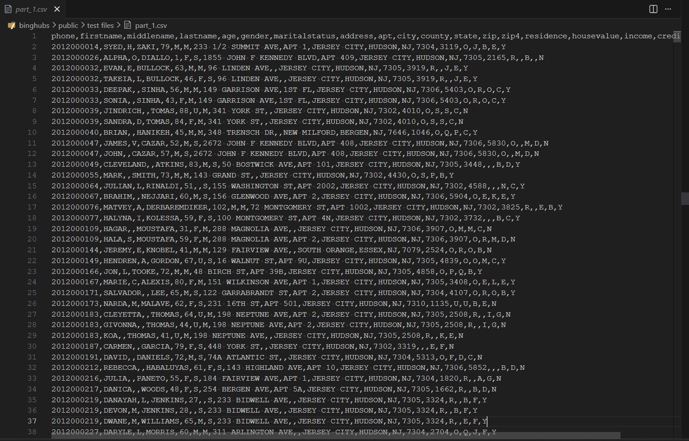
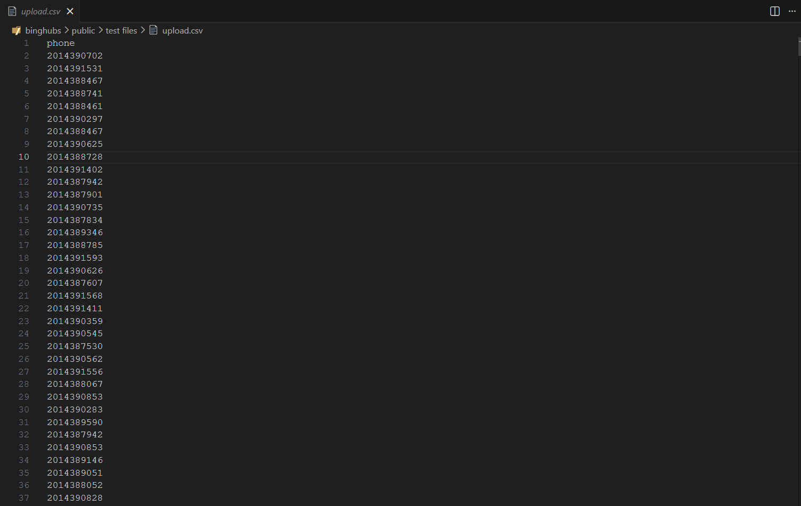
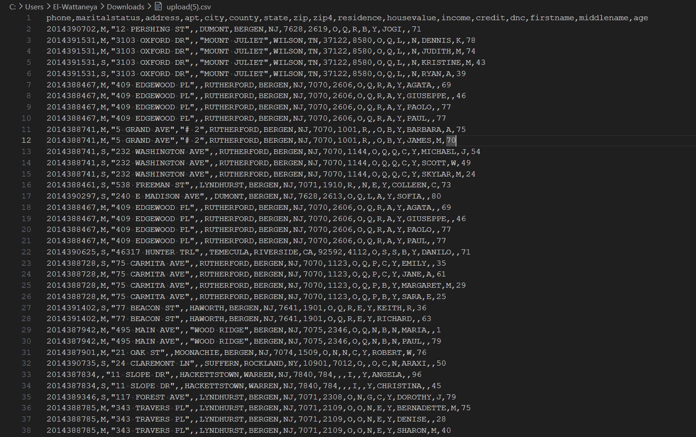
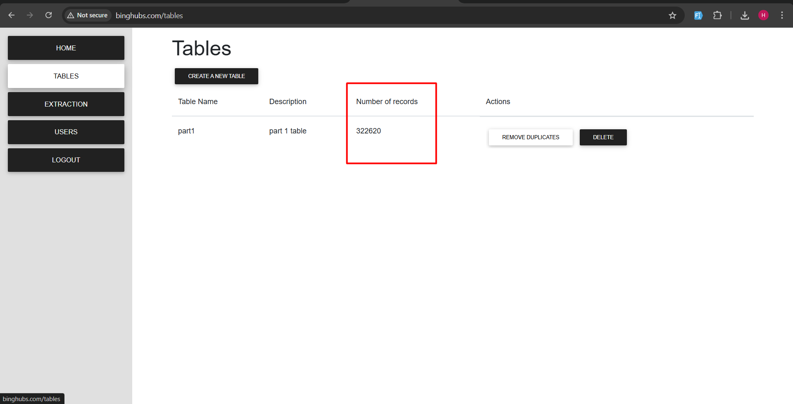
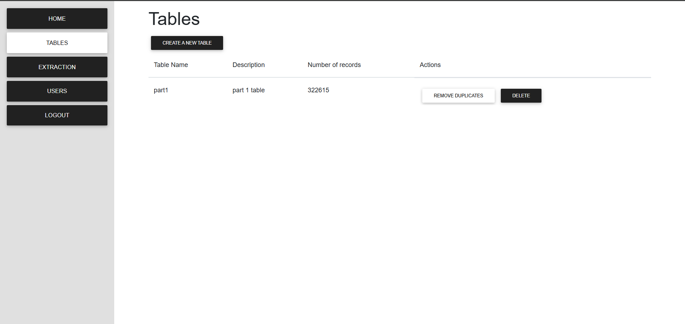
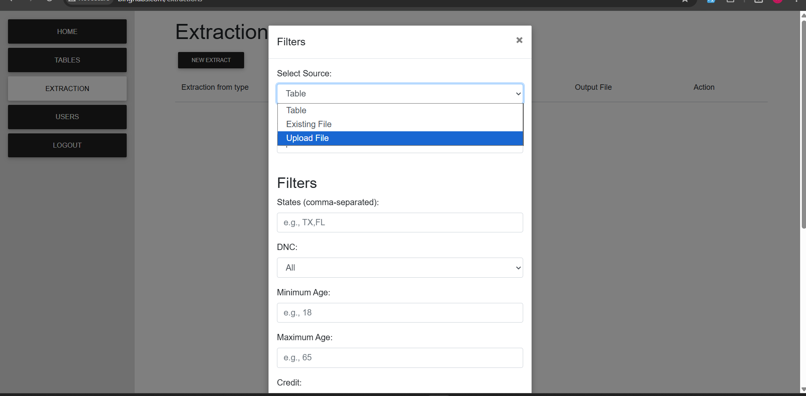
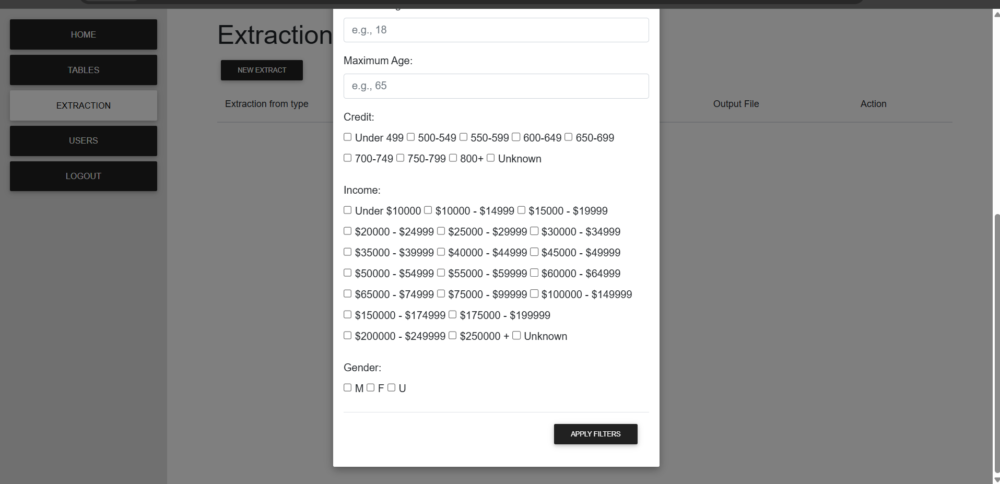

# BingHubs

BingHubs is a Laravel application for managing files, tables, data extraction, and CSV matching through an authenticated dashboard.

---

## Features

- Authentication system (login only)
- File upload and filtering

- CSV matching with database records


- Table inspection and duplicate removal


- Data extraction management


- Admin user management

---

## Requirements

- PHP >= 8.1
- Composer
- MySQL / MariaDB
- Node.js & NPM
- Git

---

## Installation

### 1. Clone Repository

```bash
git clone https://github.com/HossamSoliuman/binghubs.git
cd binghubs
````

### 2. Install Dependencies

```bash
composer install
npm install
npm run build
```

### 3. Environment Setup

```bash
cp .env.example .env
php artisan key:generate
```

Update database credentials inside `.env`.

### 4. Run Migrations & Seeders

```bash
php artisan migrate --seed
```

This will create the default admin user automatically.

### 5. Storage Link

```bash
php artisan storage:link
```

### 6. Run Application

```bash
php artisan serve
```

Open:

```
http://127.0.0.1:8000
```

---

## Default Login

```
Email: admin@example.com
Password: password
```

---

## License

MIT License

```
```
